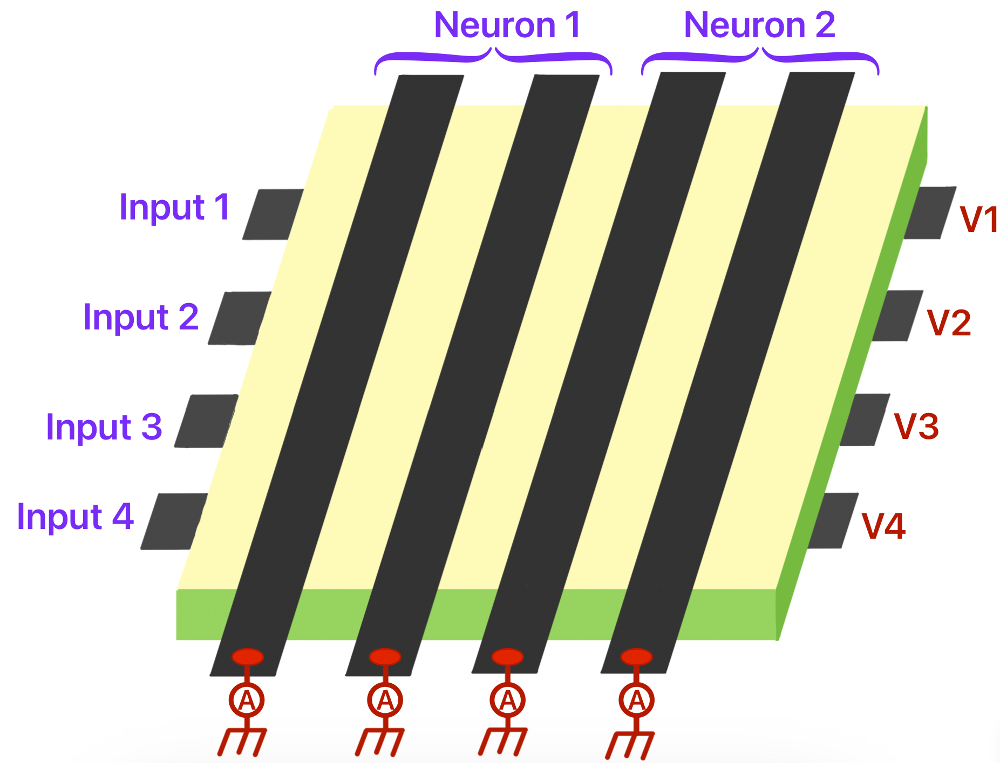

# Memristor Crossbar Training Class

This library facilitates the creation and management of **4x4 memristor crossbars** tailored for *training* a **single-layer perceptron classifier** in neuromorphic computing applications. It provides the necessary tools for training simulations using binary patterns for both inputs and outputs, along with an experimental dataset that mimics how the physical crossbar device behaves. The library also includes features for logging, saving data, and plotting, making it easier to track and visualize the training process.  
For detailed installation instructions and usage examples, please refer to the full documentation: [Memristor Crossbar Training Class Documentation](https://memristor-crossbar-training-class.readthedocs.io/en/latest/Introduction.html).

    

