# Appendix

This appendix provides an overview of the physical principles that motivated the creation of this project and its relevance within the neuromorphic computing framework. It also includes a detailed description of the algorithm’s steps along with any modifications made to implement it in Python considering the non-idealities of the physical device. Finally, example output graphs are presented to help users verify the correctness of their results.

## Neuromorphic Computing

<u>*Neuromorphic computing*</u> is an approach to designing *hardware* and *software* that **mimics the structure and functioning of the human brain's neural networks** to improve energy efficiency and performance in tasks like pattern recognition and learning.  
The key components of neuromorphic systems are <u>*synaptic-like*</u> devices, which emulate the behavior of biological synapses. These devices enable systems to replicate brain-like learning and adaptability by adjusting their "*synaptic weights*" based on experience, similar to how biological synapses **strengthen** or **weaken** connections through a process called *synaptic plasticity*.

## Metal-Oxide Memristors Crossbars

Metal-Oxide Memristors are Spintronic devices which present a synaptic behavior after the application of **identical Voltage pulses** with <u>sufficiently high amplitude</u>. In particular, the synaptic weight is represented by the **conductance** of the device and, by sending a train of voltage pulses, it can be increased in a **non-volatile way**, emulating in this way the synapse potentiation happening in the human brain. Also, after the conductance change, it's possibile to <u>return to the previous state</u> by applying a voltage pulse of opposite polarity, emulating so the synapse depression process [*Fig2.a*].  
It is so possible to build **integrated circuits** formed by memristors arranged in a crossbar configuration which play the role of simple neural networks and can learn tasks for neuromorphic computing applications.  
In the present work, we take a 4x4 memristor crossbar circuit to which we associate a single-layer perceptron architechture with two neurons, capable of recognizing the set of patterns in *Fig2.b*.  
In the physical picture, the 4-bit patterns are represented by 2 distinct values of *voltage* which represent the "0" and "1", the synaptic weights are associated with the conductances of the memristors while the neural network outputs are connected with the output *currents*.

    

        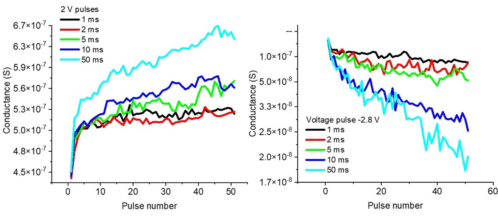
        
Figure 2.a: Conductance change as a function of the number of voltage pulses and pulse duration [1].

    

    

        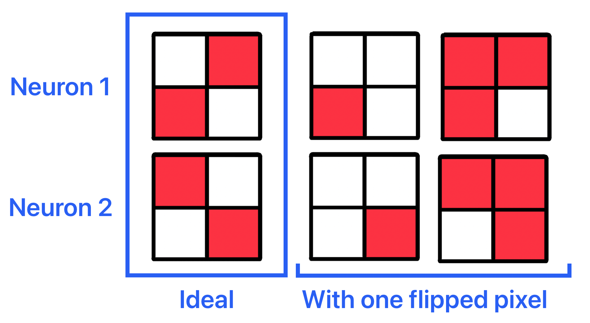
        
Figure 2.b: Training set of 4-bit patterns.

    

## Training Algorithm 

In the following section is described the mathematical algorithm used for the training of the neural network. 
As I introduced before, the memristive crossbar has been used to implement a single-layer perceptron with 4 inputs and 2 outputs. 
In particular, the outputs are calculated as <u>nonlinear activation functions</u>:

$$f_i = tanh(\beta I_i) \quad \textit{(eq. 1)}$$

of the vector-by-matrix product components:

$$I_i = \sum_{j=1}^{4} W_{ij}V_j \quad \textit{(eq. 2)}$$  

In order to have more degrees of freedom during the training, the actual network logic currents are calculated as the <u>differential output of two adjacent columns</u>, while the synaptic weights are represented by the <u>differential weigths of two adjacent columns</u>, thus forming 2 neurons containing 2 columns each:

$$I_i = I^+_i - I^-_i$$ 

$$W_{ij} = G^+_{ij} - G^-_{ij}$$

To update the weights, is used **backpropagation** with the **Manhattan update rule**:

$$\delta_i = [f^g_i(n) - f_i(n)]\frac{df}{dI}\Bigg|_{I = I_i(n)} \quad \textit{(eq. 3)}$$ 

$$\Delta_{ij}(n) = \delta_i(n)V_j(n) \quad \textit{(eq. 4)}$$ 

$$\Delta W_{ij} = sgn\sum_{n=1}^{N} \Delta_{ij}(n) \quad \textit{(eq. 5)}$$

At this point, if $\Delta W_{ij} > 0$, synapse $W_{ij}$ is **potentiated** sending a <u>positive voltage pulse to $G^+_{ij}$</u>, on the contrary, if $\Delta W_{ij} < 0$, synapse $W_{ij}$ is **depressed** sending a <u>positive voltage pulse to $G^-_{ij}$ </u>.  The parameters $\beta$ and $f^g_i(n)$ are numerical values that must be fine-tuned to achieve successful training. Specifically, $f^g_i(n)$ represents the **target value** for the activation function. If the pattern is to be recognized by the neuron as output '1', the activation function must **exceed** the target value $f^g_i(n)$. Conversely, if the pattern is to be classified as output '0', the activation function must **remain below** $f^g_i(n)$. 

    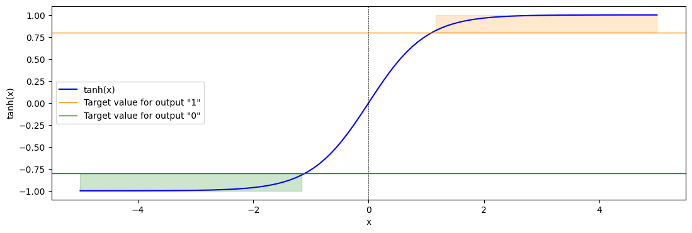

The neural network is considered successfully trained when the activation functions for all patterns lie within their respective target ranges. Additionally, in this implementation, the target values for outputs '1' and '0' are assumed to be the same for the entire set of patterns.  
All these steps are summarized in the following picture [[2]](#references):

    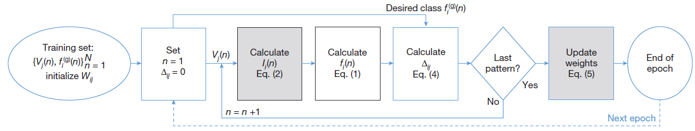

## Python Simulation

In this work, we present the implementation of a Python class that simulates the ***in-situ*** training process of a physical device. To replicate the role of synaptic depression and potentiation, the experimental dataset of conductances shown in Figure 2a (2V, 50ms) has been used. Additionally, to achieve a sufficient dynamic range and account for device-to-device variation, the conductances are initialized and updated as follows:

$$G_{ij} = K \times [(G_{exp}(m) - G_{exp}(0)) + shift_{ij}]$$

Where $K$ is a multilication factor while $shift_{ij}$ was obtained using a random lognormal distribution similar to that of the physical device. 

## Examples 

Below are examples of output graphs from a simulation that successfully converged after 18 epochs:

    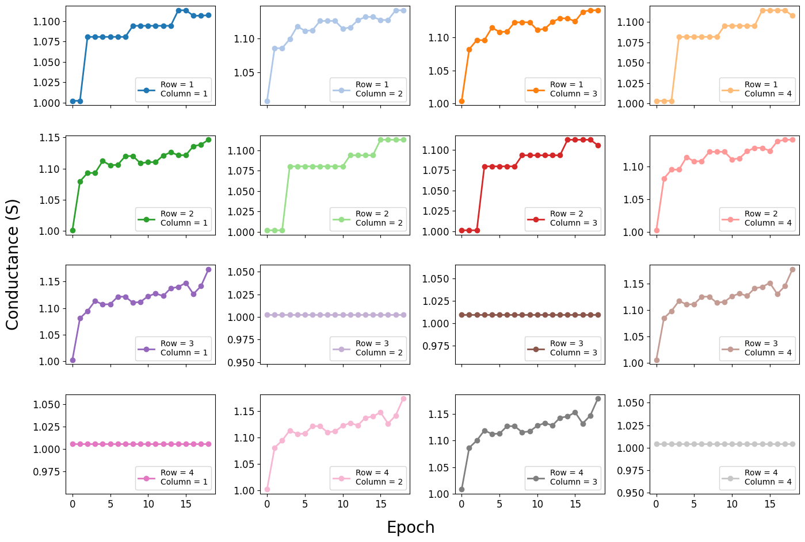

    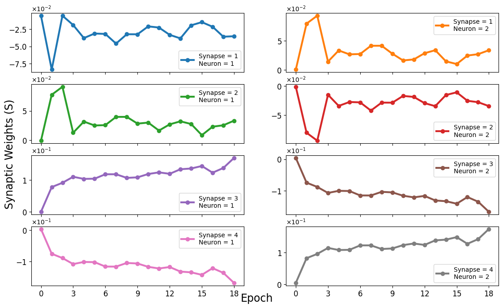

    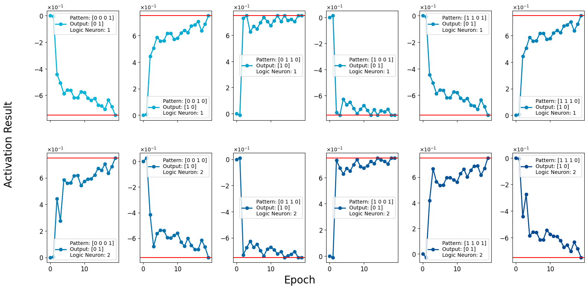

    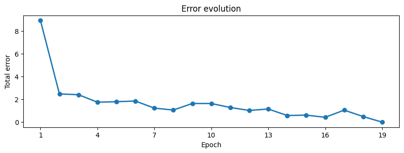

    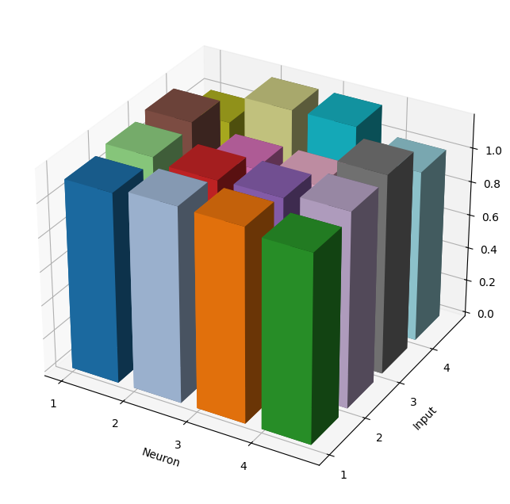

And here are examples from a simulation that did not converge after the default 48 epochs:

    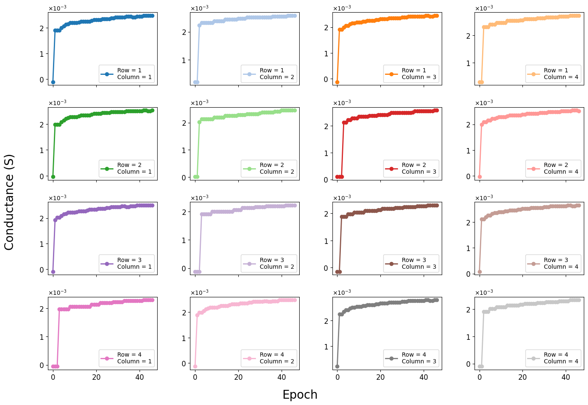

    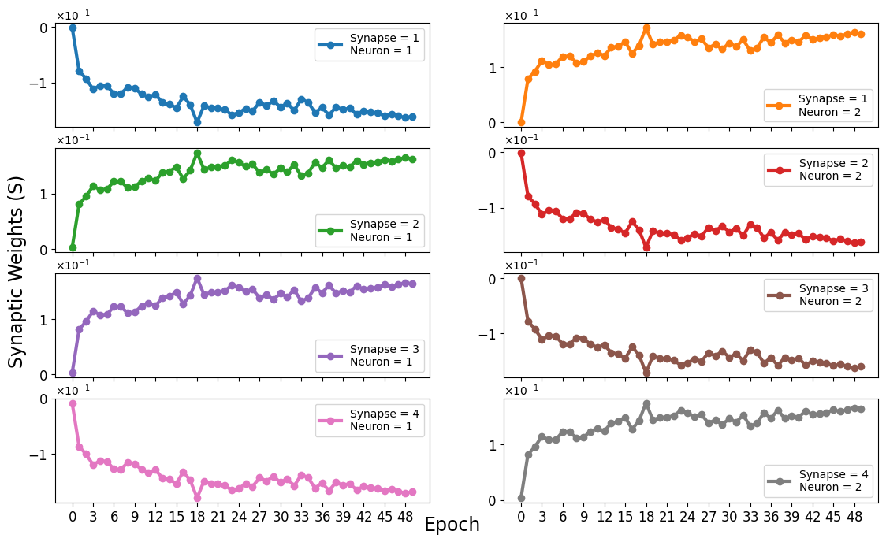

    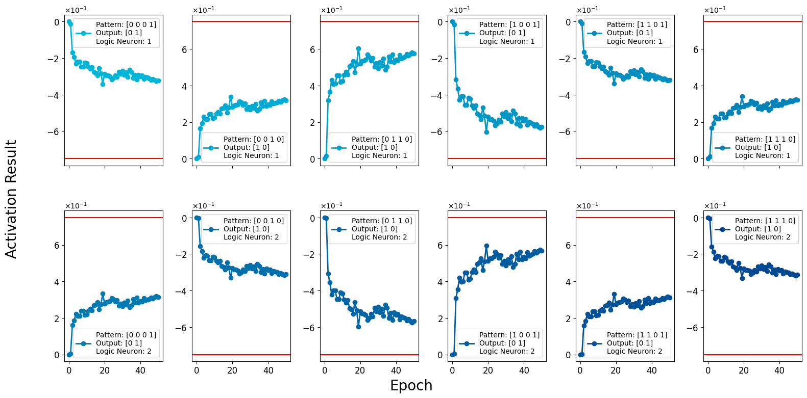

    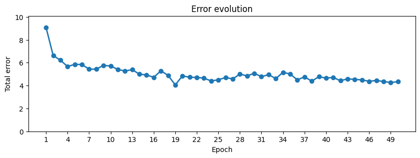

## References

[[1]](https://doi.org/10.1002/aelm.202300887) Shumilin, A., Neha, P., Benini, M., Rakshit, R., Singh, M., Graziosi, P., ... & Riminucci, A. (2024). Glassy Synaptic Time Dynamics in Molecular La0. 7Sr0. 3MnO3/Gaq3/AlOx/Co Spintronic Crossbar Devices. Advanced Electronic Materials, 2300887.  
[[2]](https://doi.org/10.1038/nature14441) Prezioso, M., Merrikh-Bayat, F., Hoskins, B. D., Adam, G. C., Likharev, K. K., & Strukov, D. B. (2015). Training and operation of an integrated neuromorphic network based on metal-oxide memristors. Nature, 521(7550), 61-64.

